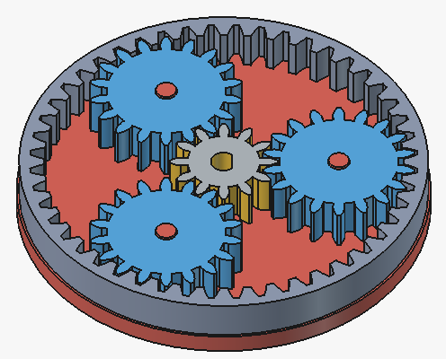
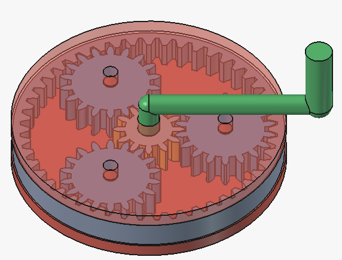
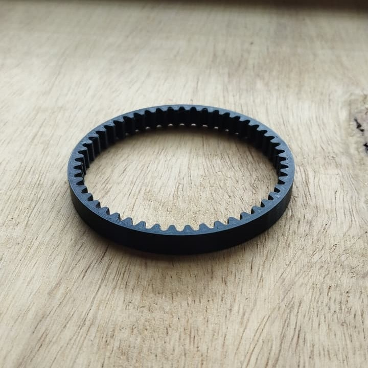
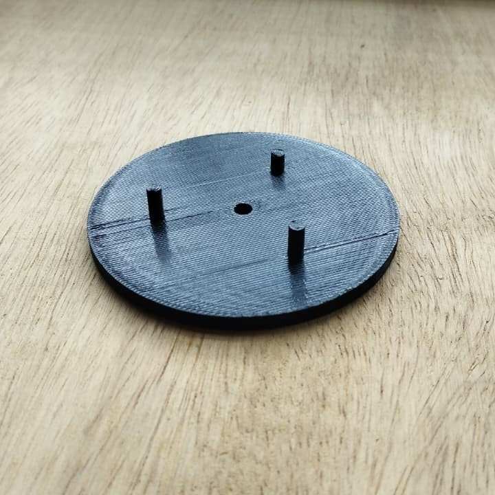
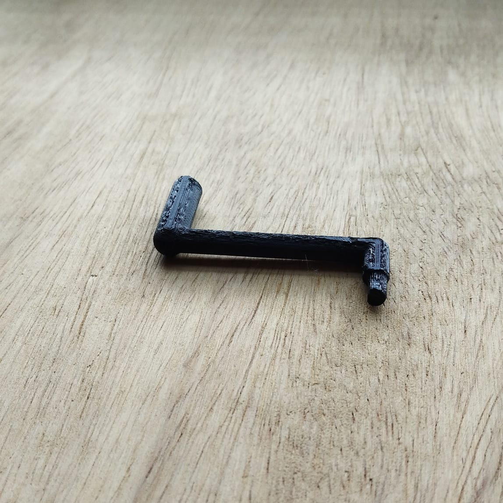
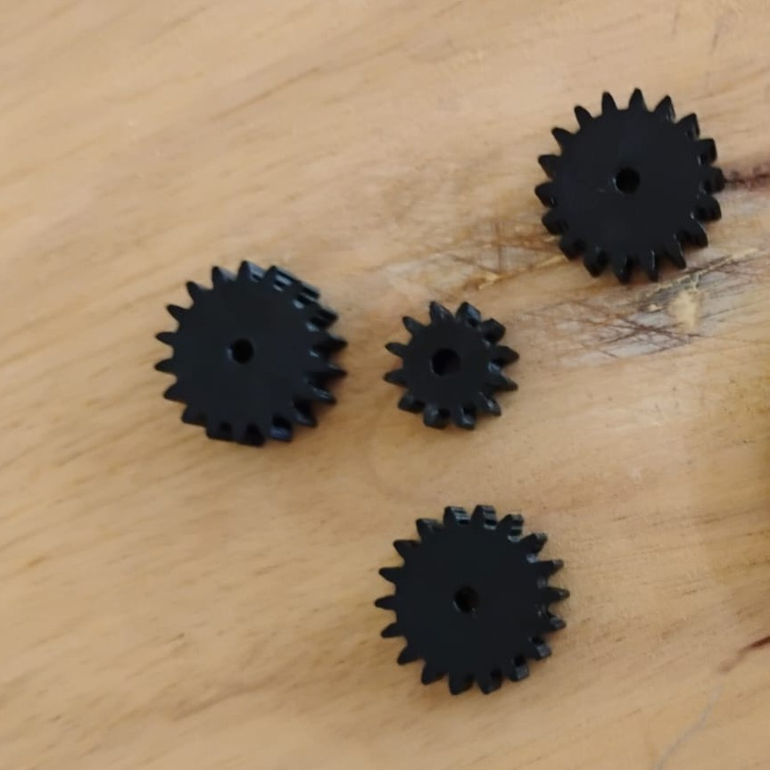
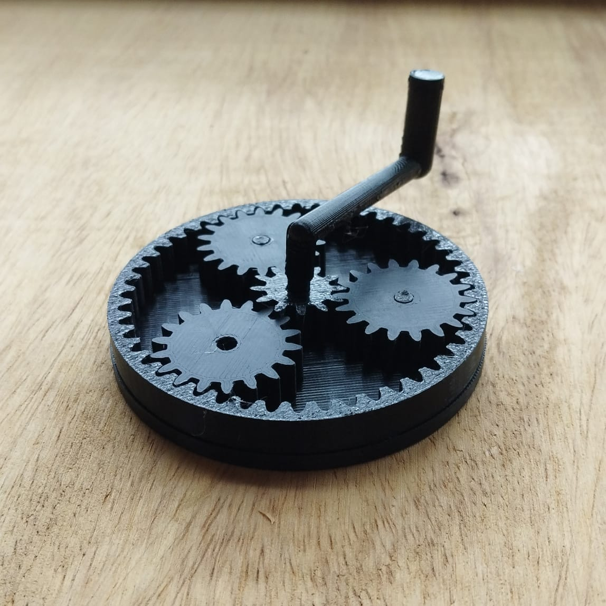

## Relatório 1 - Mecânica e Fabricação Digital

### Modelagem no CAD

<table align="center" style="border: none; border-collapse: collapse;">
  <tr style="border: none;">
    <td align="center" style="border: none; padding: 10px;">
       
      <b>(a)</b> Conjunto aberto.
    </td>
    <td align="center" style="border: none; padding: 10px;">
       
      <b>(b)</b> Manivela inserida.
    </td>
  </tr>
</table>

---

### Componentes fabricados

<table align="center" style="border: none; border-collapse: collapse;">
  <tr style="border: none;">
    <td align="center" style="border: none; padding: 12px;">
       
      <b>(a)</b> Anel
    </td>
    <td align="center" style="border: none; padding: 12px;">
       
      <b>(b)</b> Porta-satélites inferior
    </td>
  </tr>
  <tr style="border: none;">
    <td align="center" style="border: none; padding: 12px;">
       
      <b>(c)</b> Manivela
    </td>
    <td align="center" style="border: none; padding: 12px;">
       
      <b>(d)</b> Engrenagem solar e planetas
    </td>
  </tr>
</table>

---

### Conjunto montado e finalizado

   

---

### Referências

- Vídeo: [Compreender sistema de engrenagens planetárias](https://www.youtube.com/watch?v=ARd-Om2VyiE)
- Guia: [Planetary gears in FreeCAD](https://www.codemakeshare.com/?p=93)